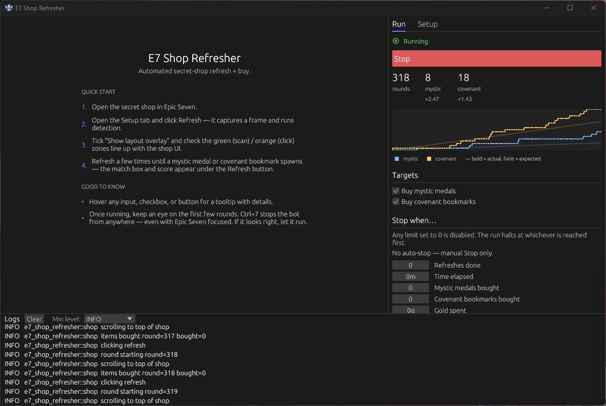

# E7 Shop Refresher

[](https://github.com/Asgarrrr/e7-shop-refresher/actions/workflows/ci.yml)
[](https://github.com/Asgarrrr/e7-shop-refresher/releases/latest)
[](https://github.com/Asgarrrr/e7-shop-refresher/releases)
[](LICENSE)
[](#download--run)

Automate Epic Seven's Secret Shop on the STOVE PC client. The bot
watches for mystic medals and covenant bookmarks, buys them, refreshes
the shop, repeats — until a stop condition fires or you hit Stop.

Windows only. No installer, no telemetry, no account credentials.



---

## Read this first

Epic Seven's [Terms of Service](https://page.onstove.com/epicseven/global)
prohibit third-party automation. Using this software risks an account
ban from Smilegate / STOVE. No warranty, no liability — use at your
own risk.

- Captures stay on your machine. Nothing leaves the PC.
- The mouse moves on its own while a run is active. Touch the mouse or
  keyboard and the bot yields — it pauses and resumes only once you've
  been idle for a moment (cooperative mode, on by default).
- The game window is brought to the foreground before every click.

## Download & run

1. Grab the latest `e7-shop-refresher-vX.Y.Z-windows-x64.zip` from the
   [Releases page](../../releases/latest). `SHA256SUMS.txt` is published
   next to it for integrity verification.
2. Unzip anywhere (e.g. `Desktop\e7-shop-refresher\`).
3. Open Epic Seven on the STOVE client. Emulators aren't supported.
4. Double-click `e7-shop-refresher.exe`. Windows will prompt for admin
   rights — accept, otherwise the bot's clicks won't reach the game.
5. Click **Start** on the Run tab.

That's it. Click positions, the item-grid search region, and the two
item icon templates ship inside the binary, so the bot runs on a stock
STOVE client without any setup.

## Daily use

1. Open the Secret Shop in Epic Seven.
2. Launch `e7-shop-refresher.exe`.
3. Click **Start**.

While a run is active the Run tab shows live counts per item plus a luck
ratio (`×2.47` = bought ÷ expected from the shop drop rates; `×1.00` is
average, higher is luckier) and a chart tracking actual pulls against
that expected rate — bold is actual, faint is expected, so a run
trending below the drop rate is obvious at a glance.

Stop conditions and item toggles are live-editable while the bot is
running — changes apply at the next round.

The **On completion** section on the Run tab decides what happens when a
stop condition fires: sleep the PC (one-shot; a manual Stop never
suspends) and/or POST a one-line summary to a Discord webhook.

**Emergency stop:** `Ctrl+7` from anywhere — works even when Epic Seven
has focus.

## Sharing the mouse

You don't have to surrender the PC for a whole run. **Cooperative mode**
(on by default) pauses the bot the instant you touch the mouse or
keyboard and resumes only after you've been idle for **Yield to user
(idle ms)** — 1.5 s by default. Tune it under Setup → Timing; set it to
`0` to disable, after which the bot fights you for the cursor.

It's a courtesy pause, not the emergency brake — for a hard stop use
`Ctrl+7` or the Stop button.

## Stop conditions

Any one of these triggers a clean stop at the next round boundary:

- `max_refreshes` — number of refresh cycles.
- `stop_after_minutes` — wall-clock duration.
- `stop_when_mystic_medals` — total mystic medals bought.
- `stop_when_covenants` — total covenant bookmarks bought.
- `stop_when_gold_spent` — gold budget.

Zero = disabled. All zero = run until manual Stop.

## Auto-updates

On launch the app checks GitHub for a newer release (cached for 6 h so
the anonymous rate limit stays clear). When one's available, a small
banner appears at the bottom of the side panel with a **Download &
restart** button. It downloads the new binary, verifies it against the
release's `SHA256SUMS.txt`, swaps the current `.exe` in place, and
relaunches. Config and templates are untouched.

## Discord notifications

Paste a webhook URL into **Run → On completion → Notify Discord**. When
a stop condition fires, the bot POSTs a short summary (reason, duration,
counts, gold spent). Manual Stop and Failed runs never trigger it. The
*Send test* button below the field gives immediate feedback so you can
confirm the URL works without waiting for a real run.

Webhook URL: Discord → *Server Settings → Integrations → Webhooks → New
Webhook → Copy Webhook URL*. The URL is stored locally in `config.toml`
and never sent anywhere except Discord.

## When the bundled defaults miss

The bundled layout works on the stock STOVE client. The Setup tab runs
detection live on the central snapshot — each match shows its NCC score
and margin as you watch, so there's nothing to trigger by hand. If
detection misses on your resolution or after a game patch:

- **Item detection misses.** In **Setup → Layout → Reference templates**,
  click *Edit* next to the alias, then drag a tight rectangle around the
  mystic medal or covenant icon on the snapshot. The Detector reloads on
  release.
- **Click lands next to a button.** Drag the red **Buy reference** line
  onto any item row, then drag the **Buy click** box down onto that row's
  Buy button (Setup → Layout → Click zones). Both are also typeable as
  y/h ratios.
- **Click zones drift.** Setup → Layout → Click zones lets you redraw the
  *Refresh* button, the two modal confirms, and the buy-column X strip.

The **[full setup walkthrough](docs/setup.md)** has screenshots for
each step. 99% of users won't need it.

## Troubleshooting

**Game window not found.** Epic Seven isn't running, or its title
doesn't match `[window].title_contains` (default `Epic Seven`).

**False matches across scrolls.** Re-crop the offending template tighter
on the icon centre and raise the **NCC threshold** on the Setup tab to
0.92–0.93. The live match list there shows the score per item; anything
below ~0.95 on a real item means the template needs work. A built-in
hue-histogram check already drops cross-colour false positives (orange
medal correlating with the green bookmark) on its own.

**Bot freezes for several seconds.** Keep `auto_resize` off (the
default). Forcing a resize at startup can wedge the capture backend.

**Stop unresponsive.** Worst case ~200 ms; longer means a click
animation is in flight. The GUI join is best-effort.

## Configuration

Every knob is editable in the GUI. `config.toml` is the backing store
(auto-saved with a 250 ms debounce). Only `[window]` and `[templates]`
ever need hand-editing.

Config and templates default to `%APPDATA%\e7-shop-refresher\`. Drop a
`config.toml` next to the .exe for portable mode. Override either with
`-c <path>`.

## CLI

`e7-shop-refresher-cli.exe` is the headless sibling. `--dry-run`
validates config without clicking.

## For developers

```powershell
git clone https://github.com/Asgarrrr/e7-shop-refresher
cd e7-shop-refresher
cargo build --release
```

Rust 1.85+ stable. CI runs `cargo fmt --check`, `cargo clippy -D warnings`,
and `cargo test`. See [ARCHITECTURE.md](ARCHITECTURE.md) for the code map
and invariants, and [CHANGELOG.md](CHANGELOG.md) for the release history.

## License

MIT — see [LICENSE](LICENSE).

Not affiliated with Smilegate, Super Creative, or STOVE.
